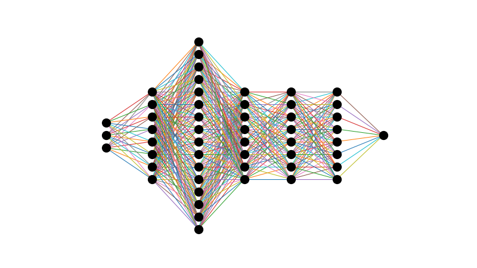
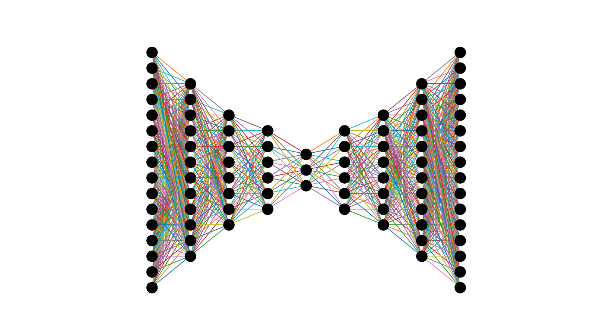

# Artificial-Neural-Network-from-Scratch

A Neural network is a type of bio-inspired machine learning model based loosely on a brain. First developed in 1957 by two MIT researchers, it has grown to become one of the most widely used technologies to date. Many companies have made APIs/libraries to make it easier for others to use, simplifying the training process and building process of the model. Tensorflow by Google and Pytorch by Facebook are the most popular deep learning APIs/libraries out on the market today, with Caffe starting to become popular.

However, because these APIs/libraries simplify the deep learning process, you dont get to see what happens within the 'blackbox'. This code details how a artifical neurel network is built, trained and used to predict new data. This is done through unpresidented visuals using matplotlib plotting and live animations. Two examples will be used; the first a deep neural network consisting of 7 layers and an autoencoder consisting of 9.

# The Code
The neural network is broken into three pieces; the buidling of the model, the feedforward and finally the backpropagation of the model. 

## Building the Model
The buidling of the model is achieved using three different object methiods; adding a input layer with a specified shape, adding a hidden layer with a specified number of neurons and finally adding a output layer of specified shape. The number of neurons in each layer determines the dimensions of the weights matrix connecting them. For example, a hidden layer of 8 neurons connecting to another hidden layer of 8 neruons will have a weights matrix of 8x8. The model weights are stored as an numpy array within the 'NeuralNetwork' object, where created and accessed using the built in python fucntions 'setattr' and 'getattr' respecfully. 

The function of 'generate_architecture' and 'plot_live_architecture' allows the viewer to visualise the model architecture. See the deep neural network's (left) and autoencoder's (right) architecture below.

 

## Feedforward
The feedforward process of the model is achieved using the 'feedforward' fucntion. This initally takes in x data and inputs it into the input layer. Then, a for loop is used over the hidden layers and output layer along with the respective current weight matrices (first feedforward will use the randomly initialized weights) to calculate the output value.

## Backpropagation
