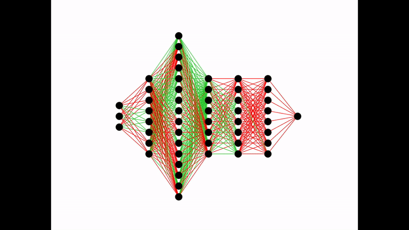

# Artificial-Neural-Network-from-Scratch
A Neural network is a type of bio-inspired machine learning model based loosely on a brain. First developed in 1957 by two MIT researchers, it has grown to become one of the most widely used technologies to date. Many companies have made APIs/libraries to make it easier for others to use, simplifying the training process and building process of the model. Tensorflow by Google and Pytorch by Facebook are the most popular deep learning APIs/libraries out on the market today, with Caffe starting to become popular.

However, because these APIs/libraries simplify the deep learning process, you don't get to see what happens within the 'blackbox'. This code details how an artificial neural network is built, trained and used to predict new data. This is done through unprecedented visuals using matplotlib plotting and live animations. Two examples will be used; the first a deep neural network consisting of 7 layers and an autoencoder consisting of 9.

# The Code
The neural network is broken into three pieces; the building of the model, the feedforward and finally the backpropagation of the model. 

## Building the Model
The building of the model is achieved using three different object methods; adding an input layer with a specified shape, adding a hidden layer with a specified number of neurons and finally adding an output layer of specified shape. The number of neurons in each layer determines the dimensions of the weights matrix connecting them. For example, a hidden layer of 8 neurons connecting to another hidden layer of 8 neurons will have a weights matrix of 8x8. The model weights are stored as a numpy array within the 'NeuralNetwork' object, were created and accessed using the built-in python functions 'setattr' and 'getattr' respectively. 

The function of 'generate_architecture' and 'plot_live_architecture' allows the viewer to visualise the model architecture. See the deep neural network's (left) and autoencoder's (right) architecture below.

 

## Feedforward
The feedforward process of the model is achieved using the 'feedforward' function. This initially takes in x data and inputs it into the input layer. Then, a for loop is used over the hidden layers and output layer along with the respective current weight matrices (the first feedforward will use the randomly initialized weights) to calculate the output value.

## Backpropagation
The backpropagation process starts with calculating the loss between the actual data and the calculated model output. There are many available loss functions which can be used in the backpropagation process, however, for this problem the loss function is a simple sum-of-squares error. This is the sum of the difference between each predicted value and the current value.

After the error has been found, we can now propagate the error back and update the weights of the model. To find the magnitude of weight adjustment, we need to find the derivative of the loss function with respect to the weights. Using this loss function (sum-of-squares error), we cannot directly calculate the derivative of the loss function with respect to the weights and biases because the loss function does not contain these variables. Hence, the chain rule is used to calculate this.

The magnitude of weight adjustment is calculated using this method and implemented into python using a for loop. The weights are then adjusted and the process of 'Feedforward' and 'Backpropagation' is then repeated for a specified number of epochs.

The code then allows the user to plot the training of the model using the function of 'plot_live_architecture'. This takes in d_weights, the array detailing the magnitude of weight adjustment, as an input. A positive weight adjustment results in a green line and a negative weight adjustment results in a red line. This is plotted using matplotlib. See the training of the deep neural network (left) and autoencoder (right) below.

 

## Loss plot
The Training loss vs Epoch was then plotted using the 'plot_loss' fucntion. See the loss vs Epoch for the deep neural network training process (left) and autoencoder training proces (right) below.

 

# Future work
* Exploration and implimentation of a more efficent optimiser. E.g. Adam optimiser.
* Exploration and implimentation of a more efficent loss function. E.g. RMSE.
* Exploration and implimentation of a more efficent Activation fucntion. Relu/Leaky Relu.

# Requirements

* python 3.5.x
* numpy 1.15.0
* matplotlib 3.3.0
* itertools
* math
